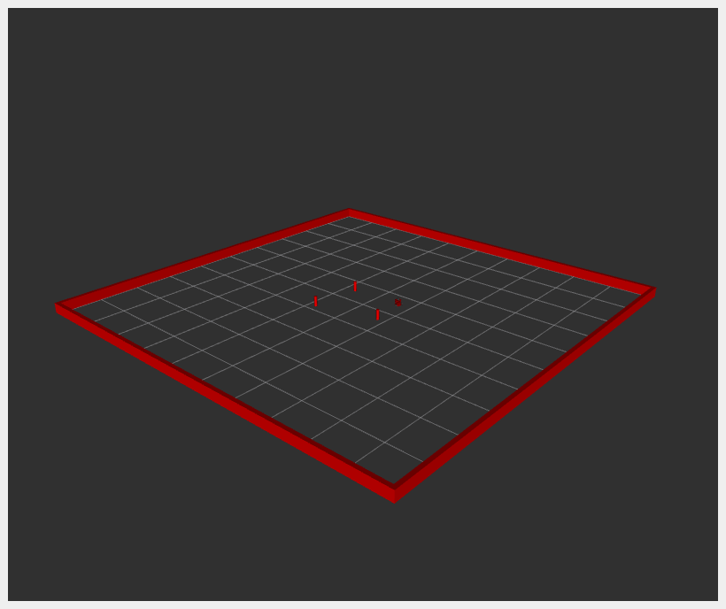

# NUSIM
Simulate the turtlebot and display it in `rviz`

## Launch files
To launch the `nusim`, run `ros2 launch nusim nusim.launch.xml`
```
Arguments (pass arguments as '<name>:=<value>'):

    'config_file':
        Simulator configuration file
        (default: 'basic_world.yaml')

    'use_rviz':
        Where to launch the rviz to visualize. Valid choices are: ['true', 'false']
        (default: 'true')

    'use_jsp':
        Whether to use the joint state publisher. Valid choices are: ['true', 'false']
        (default: 'true')

    'color':
        The color of the base link. Valid choices are: ['red', 'green', 'blue', 'purple']
        (default: 'purple')

``` 

## Configuration
 - `rate`: The frequency for the simulator
 - `x0`: The initial x coordinate
 - `y0`: The initial y coordinate
 - `theta0`: The initial orientation
 - `arena_x_length`: The arena length in x direction
 - `arena_y_length`: The arena length in y direction
 - `obstacles/x`: The list of x coordinates of the obstacles
 - `obstacles/y`: The list of y coordinates of the obstacles
 - `obstacles/r`: The radius of the obstacle

## Running `nusim`


