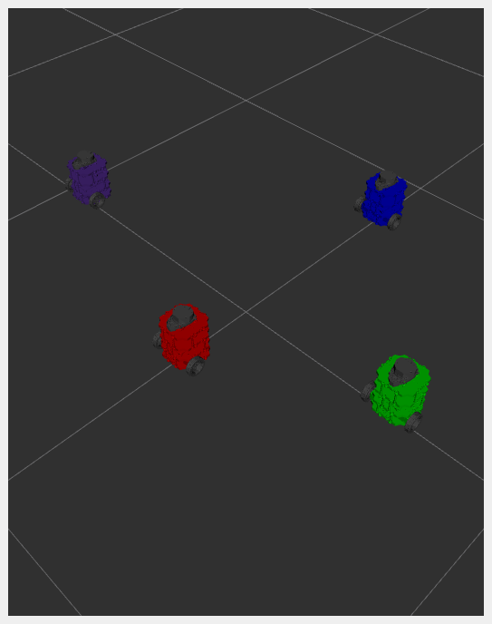

# NUTURTLE  DESCRIPTION
URDF files for Nuturtle `nuturtlebot3_burger`
* `ros2 launch load_one.launch.py` to see the robot in rviz.
* `ros2 launch load_all.launch.xml` to see four copies of the robot in rviz.

* The rqt_graph when all four robots are visualized (Nodes Only, Hide Debug) is:

# Launch File Details
* `ros2 launch -s nuturtle_description load_one.launch.py`
  ```
  Arguments (pass arguments as '<name>:=<value>'):

    'use_rviz':
        Where to launch the rviz to visualize. Valid choices are: ['true', 'false']
        (default: 'true')

    'use_jsp':
        Whether to use the joint state publisher. Valid choices are: ['true', 'false']
        (default: 'true')

    'color':
        The color of the base link. Valid choices are: ['red', 'green', 'blue', 'purple']
        (default: 'purple')

  ```
* `ros2 launch -s nuturtle_description load_all.launch.xml`
  ```
  Arguments (pass arguments as '<name>:=<value>'):

    'use_rviz':
        Where to launch the rviz to visualize. Valid choices are: ['true', 'false']
        (default: 'true')

    'use_jsp':
        Whether to use the joint state publisher. Valid choices are: ['true', 'false']
        (default: 'true')

    'color':
        The color of the base link. Valid choices are: ['red', 'green', 'blue', 'purple']
        (default: 'purple')

  ```
